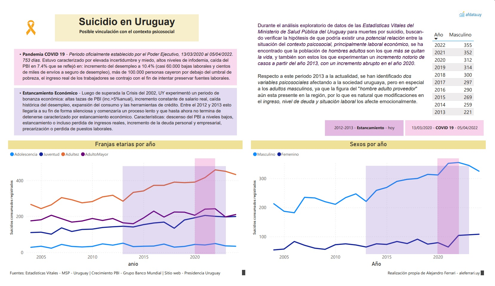
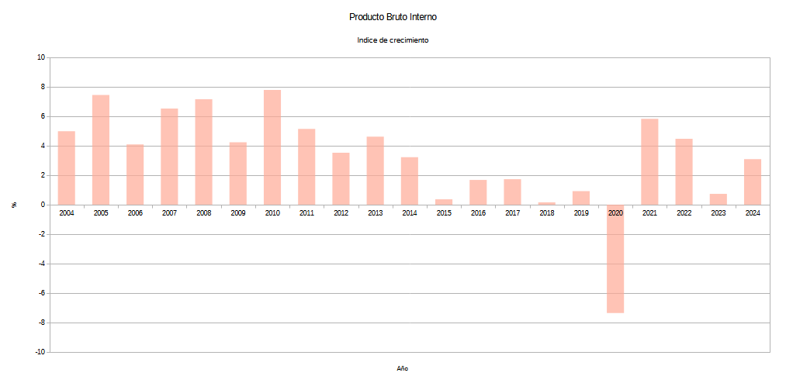

# Suicidio en Uruguay
## Posible vinculación con el contexto psicosocial - 2004-2024

---
## PBI

Desarrollo propio

Fuente: Banco Mundial - [Link...](https://datos.bancomundial.org/indicador/NY.GDP.MKTP.KD.ZG?end=2024&locations=UY&start=1961&view=chart)

Se observa como se instala el "*estancamiento económico" a partir del año 2015*" aunque el proceso de comienzo de la caída del PBI comenzó entre 2012 y 2013 habiendo marcado un *fin* para el fenómeno económico posterior a la crisis del año 2002 conoido como "**el viento de cola**" caracterizado por un desarrollo continuo de una sensación de *bienestar económico*.

---
