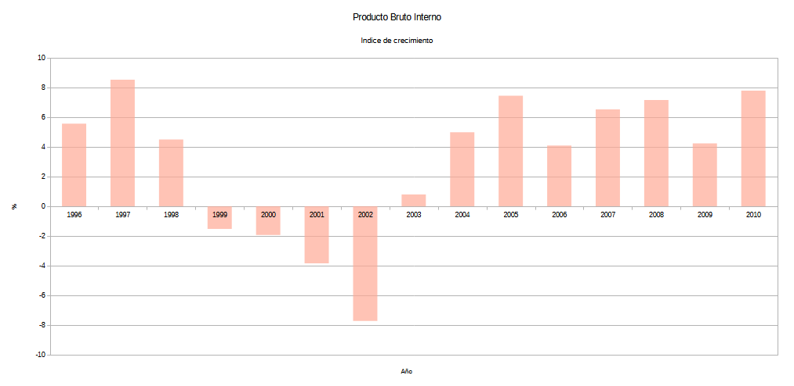
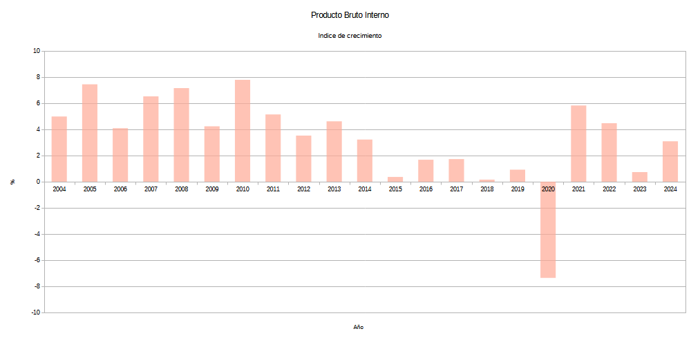

# Suicidio en Uruguay
## Contexto psicosocial vinculado a la "crisis económica de 2002"

Desarrollo propio

Fuente: Banco Mundial - [Link...](https://datos.bancomundial.org/indicador/NY.GDP.MKTP.KD.ZG?end=2024&locations=UY&start=1961&view=chart)

Previo a la *crisis económica del año 2002* se observa un patrón de evolución en el PBI similar al observado en el estudio realizado sobre el periodo 2004 - 2024 cuando entre los años 2012 y 2013 vemos el comienzo de una pendiente de caída, la que se puede incluso estimar, habria comenzado mucho antes, entre los años 2010 - 2011. Estaríamos ante el registro reflejo de consecuencias del final del periodo conocido como "*el viento de cola*" experimentado por la economía uruguaya luego de superar la crisis del año 2002.

---
