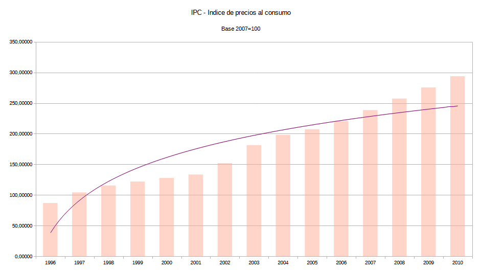

# Suicidio en Uruguay
## Contexto psicosocial vinculado a la "crisis económica de 2002"

Estudio en proceso... 🎠🎠🎠...

### Producto Bruto Interno (PBI)

Desarrollo propio

Fuente: Banco Mundial - [Link...](https://datos.bancomundial.org/indicador/NY.GDP.MKTP.KD.ZG?end=2024&locations=UY&start=1961&view=chart)

Previo a la *crisis económica del año 2002* se observa un patrón de evolución en el PBI similar al observado en el [estudio realizado sobre el periodo 2004 - 2024](https://github.com/aleferrariuy/data-analytics/tree/main/cases/suicidio-contexto-psicosocial-2004-2024-Uruguay) cuando entre los años 2012 y 2013 vemos el comienzo de una pendiente de caída, la que se puede incluso estimar, habria comenzado mucho antes, entre los años 2010 - 2011. Estaríamos ante el registro reflejo de consecuencias del final del periodo conocido como "*el viento de cola*" experimentado por la economía uruguaya luego de superar la crisis del año 2002.

### Índice de Precios al Consumo (IPC)

Desarrollo propio

Fuente: Instituto Nacional de Estadística (INE) - [Link...](https://www.gub.uy/instituto-nacional-estadistica/datos-y-estadisticas/datos/series-historicas-ipc-base-marzo-1997100)

En el registro histórico de IPC (indice de precios al consumo) se observa una clara tendencia al incremento, lo que se vería reflejado en el costo de vida.

La cantidad de bienes y servicios que componen la canasta de consumo promedio de los hogares, que se podía adquirir con 100 pesos uruguayos en Enero del año 1997, tiene un costo estimado de 310,9 pesos uruguayos en Diciembre del 2010. La tasa de variación del IPC en el periodo fue de 210,9%.
Como la fecha inicial es anterior a diciembre del 2010, no hay información desagregada para Montevideo e Interior.

https://www7.ine.gub.uy/Dashboard-IPC/

---
